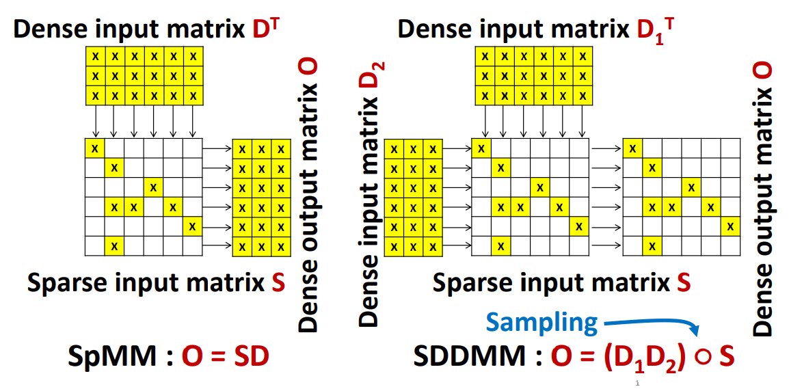

# Conceptual View



# Steps

* &#9989; Write Python bindings for SpMM with Pytorch tensors.
* &#9989; Write Python bindings for SDDMM with Pytorch tensors.
* &#9989; Wrap SpMM and SDDMM with **torch.autograd.Function** to make them first class citizens of PyTorch.

```Python
import sputnik

class MyLinearFunction(torch.autograd.Function):
    @staticmethod
    def forward(ctx, input, weights):
        outputs = sputnik.forward(input, weights)
        ctx.save_for_backward(*variables)

        return outputs

    @staticmethod
    def backward(ctx):
        outputs = sputnik.backward(*ctx.saved_tensors)
        return outputs
```

* Replace original attention products with sparse implementation.

Original implementation:

```Python
  logits = matmul(q, k, transpose_b=True)
  logits = add(logits)
  weights = softmax(logits)
  return matmul(weights, v)
```
Sparse implementation:

```Python
  q_3d, k_3d, v_3d = [preprocess_attention_component(x) for x in [q, k, v]]
  logits = replicated_sddmm(q_3d, k_3d, topology, transpose_rhs=True)
  weights = replicated_sparse_softmax(logits, topology)
  out = replicated_spmm(weights, topology, v_3d)
  return reshape(out, tf.shape(q))
```

* &#9989; Implement csr softmax (to avoid sparse to dense conversion in sparse dot product attention)

* &#9989; Implement csr transposition (we need it to calculate the gradient of both spmm and sddmm)

```Python
def _spmm_grad(op, grad):
  """Gradient operation for sparse matrix matrix multiplication."""
  m = op.inputs[0]
  k = op.inputs[1]
  values = op.inputs[2]
  row_indices = op.inputs[3]
  row_offsets = op.inputs[4]
  column_indices = op.inputs[5]
  dense_matrix = op.inputs[6]

  # Sparse matrix gradient: multiply the gradient by the transposed
  # dense matrix.
  sparse_matrix_grad = kernels.sddmm(
      m,
      k,
      row_indices,
      row_offsets,
      column_indices,
      grad,
      dense_matrix,
      transpose_rhs=True)

  # Dense matrix gradient: transpose the sparse weights, calculate the
  # new row indices, and multiply sparse matrix with dense gradient.
  values_t, row_offsets_t, column_indices_t = kernels.csr_transpose(
      m, k, values, row_offsets, column_indices)
  row_indices_t = diffsort(row_offsets_t)
  dense_matrix_grad = kernels.spmm(k, m, values_t, row_indices_t, row_offsets_t,
                                   column_indices_t, grad)

  return [None, None, sparse_matrix_grad, None, None, None, dense_matrix_grad]
```
